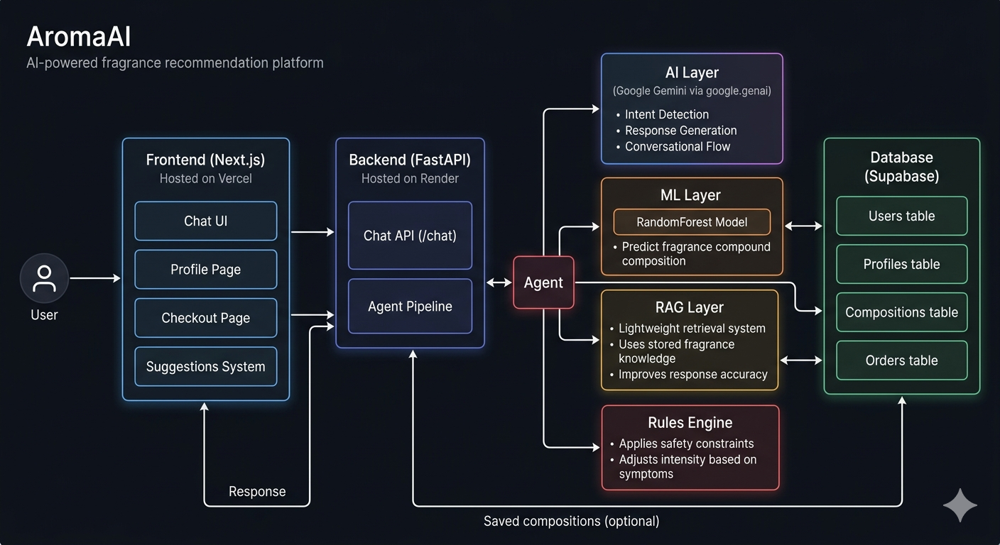

# AromaAI - Personalized Fragrance Intelligence System

AromaAI is an AI-powered fragrance assistant that creates custom perfume compositions based on user preferences, sensitivities, and emotional cues - delivering a safe, personalized, and luxurious scent experience.


## Problem Statement

Traditional perfumes are:

* ❌ Generic and not personalized
* ❌ Can trigger discomfort (headache, allergies, nausea)
* ❌ Difficult for users to understand or customize

Users need a system that:

* Understands their body reactions
* Learns their preferences
* Generates safe + customized fragrance compositions


## Solution - AromaAI

AromaAI combines:

- Conversational AI (LLM)
- ML-based compound prediction
- Lightweight RAG (knowledge grounding)
- Structured composition generation

To deliver:
- Safe fragrance recommendations
- Personalized compositions (with % breakdown)
- Continuous conversational refinement

## 🏗️ Architecture


> End-to-end flow: User → AI Agent → ML Model → RAG → Supabase → UI

## Features

- Conversational AI (human-like interaction, not rigid Q&A)
- AI-generated fragrance compositions with percentages
- Sensitivity-aware (headache, allergies, nausea)
- Dynamic refinement (lighter, stronger, different scent)
- Lightweight RAG for accurate, grounded responses
- Profile saving with Supabase
- Checkout-ready composition system
- Multi-user support (create for self, friends, family)

## 🌐 Live Demo

🚀 Try AromaAI:

- [Frontend App](https://aroma-ai-beta.vercel.app/)  
- [Backend API](https://aromaai.onrender.com/)

> ⚠️ First request may be slow due to server wake-up.


## Tech Stack

**Client:** Next, TypeScript, TailwindCSS, Framer Motion

**Server:** FastAPI, Python, Uvicorn

**AI/ML:** Google GenAI (Gemini), Scikit-learn (RandomForest), Pandas / NumPy

**Database:** Supabase (PostgreSQL)

**Deployment:** Vercel (Frontend), Render (Backend)


## Usage/Examples

```javascript
User Input:
"I like citrus scents but strong ones give me headaches"

Output:

- Ethanol: 70%
- Hedione: 8%
- Linalool: 5%
- Iso E Super: 4%
- Ambroxan: 2%
- Vanillin: 1%

Explanation:
Reduced heavy compounds to avoid discomfort and kept it fresh and breathable.

Follow-up:
Would you like to make it fresher or slightly stronger?
```


## Environment Variables

To run this project, you will need to add the following environment variables to your .env file

**Backend (.env)**

```
GEMINI_API_KEY = your_key
SUPABASE_URL = your_url
SUPABASE_KEY = your_key
```

**Frontend (.env)**
```
NEXT_PUBLIC_API_URL = https://your-backend-url
NEXT_PUBLIC_SUPABASE_URL = your_url
NEXT_PUBLIC_SUPABASE_ANON_KEY = your_key
```

## Deployment

Frontend (Vercel):
- Connect GitHub repo
- Deploy automatically

Backend (Render):
- Add Web Service
- Start command:
  uvicorn main:app --host 0.0.0.0 --port $PORT

- Add environment variables

Supabase:
- Managed cloud DB (no deployment needed)


## Authors

Yamuna Latchipatruni  [@yamuna](https://github.com/Yamuna-6730)   
B.Tech CSE (Data Science)  
VNR Vignana Jyothi Institute of Engineering  

Built for ET Gen AI Hackathon 


